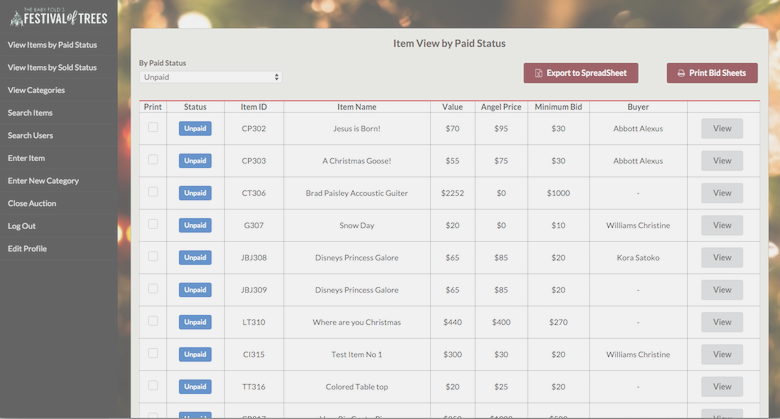

# IT485 Asp.net based web application project

## Project statement
This project is to create an information management system that stores and provides information about auction items donated for a local charity auction event. 
The system let users sign-in, donate items, retrieve item information, register bidders, manage payment status, and produces reports about items and buyers. The web-based system is developed in C# using ASP.NET. 
In order to improve efficiency of group development, our group selected MVC class structure and divided workload into each member. For user-interface design, we selected Semantic UI in order to create responsive, and aesthetically pleasing pages.

## Selected tools, technologies & frameworks

### Languages
* C#
* HTML
* CSS
* Javascript
* jQuery
* SQL

### Web frameworks
* ASP.NET
* Visual Studio 2015
* MVC
* REST API
* AJAX

### Version Control
* Git
* GitHub

### Database
* SQLServer
* Stored procedure scripting
* RDBMS

### UI framewrok
* [Semantic UI](http://semantic-ui.com/)

